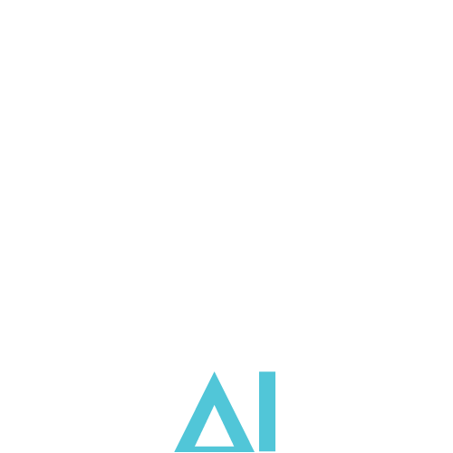

# 🏢 isolAIted — The artificial intelligence you truly own.

  <!-- Replace the path below with your actual logo URL once uploaded to the repo -->
  

  <strong>An isolated environment, on your hardware, for a Private, Autonomous and Secure AI.</strong> 
  Confidential Chats • Agentic Workflows • 24/7 Automations — No cloud, no tokens, no exceptions.

  <a href="https://www.isolaited.com/en/">🌐 Official Website</a> •
  <a href="https://www.isolaited.com/en/">📄 Documentation</a> •
  <a href="https://www.isolaited.com/en/">📧 Contact Us</a>

---

## 💡 What is isolAIted?

**isolAIted** is a 100% on-premise agentic AI platform designed for professionals and organizations handling sensitive data. It installs directly on local hardware, ensuring complete digital sovereignty and eliminating unpredictable API/subscription costs.

### 🛡️ Core Pillars
* **Sovereignty & Privacy:** Outbound connections are blocked; corporate data never leaves your local network.
* **Continuity & Zero Cost:** Operates 24/7 with no per-query fees or API rate limits.
* **Governance & Control:** Granular permissions, audit trails, and version-controlled agents for full operational control.

---

## 🛠️ Operational Levels

Deploy a secure workspace in 10 minutes and scale with three levels:
1. **💬 isol Chat:** Secure, private chatbot.
2. **🔄 isol Workflows:** AI agent teams for complex, supervised tasks.
3. **🦅 isol Claws:** 24/7 autonomous agents for monitoring and analysis.

---

## 🎯 Use Cases
Ideal for sectors requiring high security:
* **💻 Software Development:** Secure coding, testing, and debugging.
* **💼 Professional Services:** Private client data analysis and reporting.
* **⚖️ Legal/Finance:** Secure research and compliance.

---

## 🤝 Join the On-Premise AI Revolution
Developed by **Virtualway (BU AI)**.
[Download Free](https://www.isolaited.com/en/) | [Talk to an Expert](https://www.isolaited.com/en/)
